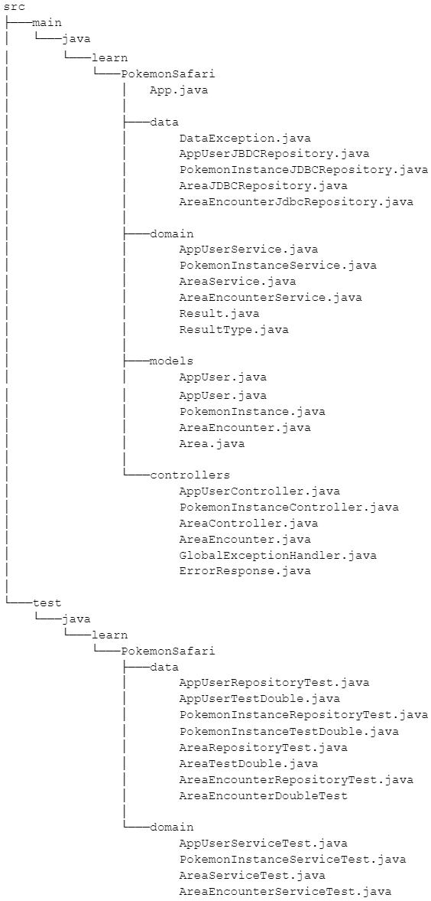

# Detailed Plan
Create a browser based pokemon game designed around the safari zone minigame. Implement all base game functionalities alongside persistent data storage using MySQL, account creation, account and session security, and data fetching from the PokeAPI.

## Key Features
### Player Account Features
- Register a new account
- Login to existing account
- Users can delete own account

### Admin Features
- Login to existing account
- Delete any non-admin account
- View all pokemon in a user’s inventory
- Create, edit, or delete pokemon in other user’s accounts
    - Edit stat values of pokemon in inventories
- View all areas
- Create, edit, or delete areas
    - Add pokemon to existing or new areas with catch rates
    - Update catch rates of existing pokemon in areas

### Game Features
- Players can view their PC Box which contains all of the pokemon they have caught
    - Players are able to view details about pokemon in their inventory
- Players can choose from many different areas to go to
- Each area houses different pokemon to encounter
- Players are able to leave areas or search for pokemon
- Players can trigger encounters by searching for pokemon in areas
- Encounters select a random pokemon from the list of available pokemon in the area and allow players a chance to catch them by performing different available actions
    - The Throw Bait action reduces pokemon catch rate but lowers their chance to flee
    - The Throw Mud action increases pokemon catch rate but increases their chance to flee
    - The Throw Pokeball action attempts to catch the pokemon using the current catch rate
    - The Run Away action ends the encounter without catching the pokemon and returns the player to the area option screen

## Project Structure

## Data
app_role
- role_name: Name of the role

app_user
- app_user_id: User unique id
- role_name: The user’s role
- username: User’s username for logging in
- password: User’s password for logging in

pokemon_instance
- pokemon_instance_id: Unique id of pokemon instance
- pokemon_name: Name of the pokemon
- app_user_id: Id of the owner of this pokemon
- max_hp: Stat determining max hp of the pokemon
- attack: Stat determining attack of the pokemon
- defense: Stat determining defense of the pokemon
- special_attack: Stat determining special_attack of the pokemon
- special_defense: Stat determining special_defense of the pokemon
- speed: Stat determining speed of the pokemon

area
- area_id: Unique id of the area
- area_name: Display name of the area

area_encounter
- area_id: Id of the area that this encounter applies to
- pokemon_name: name of the pokemon for this encounter
- encounter_rate: the possibility of triggering this encounter

## Validation
app_role
- role_name
    - Can NOT be blank

app_user
- username
    - Must be between 6 and 20 characters
- password 
    - Must between 6 and 40 characters

pokemon_instance
- pokemon_name
    - Can NOT be blank
- app_user_id
    - Can NOT be blank
- max_hp
    - Must be between 1 and 31 inclusive
- attack
    - Must be between 1 and 31 inclusive
- defense
    - Must be between 1 and 31 inclusive
- special_attack
    - Must be between 1 and 31 inclusive
- special_defense
    - Must be between 1 and 31 inclusive
- speed
    - Must be between 1 and 31 inclusive

area
- area_name
    - Must NOT be blank

area_encounter
- area_id + pokemon_name
    - Combination must be unique
- encounter_rate
    - Must be greater than 1

## Java Class Details
App
- public static void main(String[]) -- instantiate all required classes with valid arguments, dependency injection. run controller

AppUserController
- public static void add(String username, String password) – send user inputs to AppUserService to add a new user.
- public static void login(String username, String password) – use private function validate to confirm credentials. If valid, set user state, else, return errors.
- private static boolean validate(String username, String password) – validate inputted credentials.
- public static AppUser getUserById(int userId) – send userId to AppUserService and get back specified user.
- public static List<User> getAll() – get List of all current users
- public static AppUser userUpdate(int userId, String username, String password) - send credentials to AppUserService update password of logged in user
- public static AppUser adminUpdate(int userId, String username, String password)- update username or password of specified user
- public static boolean userDelete(int userId) – remove logged in user from database
- public static boolean adminDelete(int userId) - remove specified user from database

PokemonInstanceController
- public static List<PokemonInstance> getByUserId(int userId) – get all pokemon instances whose app_user_id matches userId
- private static getPokemonInfo() –  makes a query to the pokeApi get a pokemon’s information
- public static PokemonInstance add(PokemonInstance pokemonInstance) – add a pokemon instance
- public static boolean deleteById(int id) – delete a pokemon instance by its id
- public static boolean update(PokemonInstance pokemonInstance) – update a pokemon instance

AreaController
- public static List<Area> getAll() – returns a list of all areas
- public static Area add(Area area) – add a new area to database
- public static boolean deleteById(int id) – delete an area by id and all of its corresponding area encounters

AreaEncounterController
- public static List<AreaEncounter> getByAreaId(int id) – get all area encounters whose area_id matches id
- public static AreaEncounter add(AreaEncounter areaEncounter) – add a new area encounter
- public static boolean update(AreaEncounter areaEncounter) – update an area encounter
- public static boolean deleteById(int id) – delete an area encounter by id

AppUserJdbcTemplateRepository
- public static AppUser getByUsername(String username) – get a user by their username
- public static boolean deleteById(int id) – delete an app user by id

PokemonInstanceJdbcTemplateRepository
- public static List<PokemonInstance> getByUserId(int userId) – get all pokemon instances whose app_user_id matches userId
- public static PokemonInstance add(PokemonInstance pokemonInstance) – add a pokemon instance
- public static boolean deleteById(int id) – delete a pokemon instance by its id
- public static boolean update(PokemonInstance pokemonInstance) – update a pokemon instance

AreaJdbcTemplateRepository
- public static List<Area> getAll() – get all areas
- public static Area add(Area area) – add a new area to database
- public static boolean deleteById(int id) – delete an area by id and all of its corresponding area encounters

AreaEncounterJdbcTemplateRepository
- public static List<AreaEncounter> getByAreaId(int id) – get all area encounters whose area_id matches id
- public static AreaEncounter add(AreaEncounter areaEncounter) – add a new area encounter
- public static boolean update(AreaEncounter areaEncounter) – update an area encounter
- public static boolean deleteById(int id) – delete an area encounter by id

AppUserService
- public static Result<AppUser> getByUsername(String username) – run corresponding repository method
- public static boolean deleteById(int id) – run corresponding repository method

PokemonInstanceService
- public static Result<List<PokemonInstance>> getByUserId(int userId) – run corresponding repository method
- public static Result<PokemonInstance> add(PokemonInstance pokemonInstance) – run validations then run corresponding repository method
- public static boolean deleteById(int id) – run corresponding repository method
- public static boolean update(PokemonInstance pokemonInstance) – run validations then run corresponding repository method
- public static Result<AreaEncounter> validate(AreaEncounter) – run base validations outlined in validations section and return result

AreaService
- public Result<List<Area>> static getAll() – run corresponding repository method
- public static Result<Area>> add(Area area) – run validations then run corresponding repository method
- public static boolean deleteById(int id) – run corresponding repository method
- public static Result<AreaEncounter> validate(AreaEncounter) – run base validations outlined in validations section and return result

AreaEncounterService
- public static Result<List<AreaEncounter>> getByAreaId(int id) – run corresponding repository method
- public static Result<AreaEncounter> add(AreaEncounter areaEncounter) – run validations then run corresponding repository method
- public static boolean update(AreaEncounter areaEncounter) – run validations then run corresponding repository method
- public static boolean deleteById(int id) – run corresponding repository method
- public static Result<AreaEncounter> validate(AreaEncounter) – run base validations outlined in validations section and return result

AppUser
- private int appUserId
- private String roleName
- private String username
- private String password
- Full getters and setters

PokemonInstance
- private int pokemonInstanceId
- private String pokemonName
- private int appUserId
- private int maxHp
- private int attack
- private int defense
- private int specialAttack
- private int specialDefense
- private int speed
- Full getters and setters

AreaEncounter
- private int areaId
- private String pokemonName
- private int encounterRate
- Full getters and setters

Area
- private int areaId
- private String areaName
- Full getters and setters

## React Component Details
- Login – Main landing page for website where users can login or create accounts
- SafariZoneEntrance – Main menu for player users that allows them to open their pc box, open the account menu, or travel to an area
- Area – Area sub menu that allows players to search for pokemon or go back to safari zone entrance
- Encounter – Component that renders an encounter for the player to play through and attempt to catch a pokemon
- PCBox – Component that lists all pokemon in a players inventory
- Account – Menu that allows players to delete their own account
- AdminPanelHome – Main menu for admin users
- AdminPanelAreas – Sub menu for admin users to view all existing areas and allow them to delete, edit, or add new areas
- AdminPanelPlayers – Sub menu for admin users to view all players and allow them to delete non-admin users or edit the contents of their pc box
- AdminPanelAreaForm – Component that allows admins to enter new or update existing values for an area and add new pokemon encounters to the area
- AdminPanelPlayerForm – Component that allows admins to edit the contents of a player’s pc box
- NotFound – Component for 404 not found pages

## Steps Back-End
1. Create a Maven project.
2. Add jUnit5 Jupiter, Spring Boot JDBC, Spring Boot Devtools, MySQL Connector, Spring Security and Spring Boot Starter Web as maven dependencies and refresh Maven
3. Create packages
4. Implement AppUser, PokemonInstance, and Area models
5. Create data layer’s custom DataException class
6. Implement AppUserJdbcTemplateRepository class alongside its interface
a. All methods should catch IOExceptions and throw custom DataException
7. Create tests for AppUserJdbcTemplateRepository
8. Implement PokemonInstanceJdbcTemplateRepository class alongside its interface
a. All methods should catch IOExceptions and throw custom DataException
9. Create tests for PokemonInstanceJdbcTemplateRepository
10. Implement AreaJdbcTemplateRepository class alongside its interface
a. All methods should catch IOExceptions and throw custom DataException
11. Create tests for AreaJdbcTemplateRepository
12. Implement AreaEncounterJdbcTemplateRepository class alongside its interface
a. All methods should catch IOExceptions and throw custom DataException
13. Create tests for AreaEncounterJdbcTemplateRepository
14. Implement AppUserService class
a. Add all listed validation rules for app users
b. Should take an AppUserRepository isntance as a dependency
15. Implement PokemonInstanceService class
a. Add all listed validation rules for pokemon instances
b. Should take a PokemonInstanceRepository instance as a dependency
16. Implement AreaService class
a. Add all listed validation rules for areas
b. Should take an AreaRepository instance as a dependency
17. Implement AreaEncounterService class
a. Add all listed validation rules for area encounters
b. Should take an AreaEncounterRepository instance as a dependency
18. Implement AppUserController class
18. Implement AppUserController tests
19. Implement PokemonInstanceController class
20. Implement PokemonInstanceController tests
21. Implement AreaController class
22. Implement AreaController tests
23. Implement AreaEncounterController class
24. Implement AreaEncounterController tests
25. Create App class
a. Instantiate all required classes with valid arguments, dependency injection. run controller

## Steps Front-End
1. Create a react app
2. Clean folders to only have needed files.
3. Add dependencies (React Dom Router, Fetch API, )
4. Implement a Login component with buttons to login or create account
a. Login takes to login page with info
b. Create account allows for user input for account creation
5. Implement a SarfariZoneEntrance component to look at team or go catch
6. Implement Area component for looking for pokemon
a. Have a page for each area we implement
b. Make sure pokemon are tied to the correct areas
7. Implement Encounter component
a. Add the buttons for each “move” user is allowed to do.
b. See buttons work correctly with moves
8. Implement PCBox component to create a list of pokemon with each user
a. Implement release button for users
9. Implement Account.js
10. Implement AdminPanelHome component
11. Implement AdminPanelPlayers component
a. Refresh component on load and when player data changes
12. Implement AdminPanelAreas component
a. Refresh component on load and when area data changes
13. Implement AdminPanelPlayerForm component
14. Implement AdminPanelAreaForm component
15. Implement NotFound component

## Technologies
### Front-end
- React

### Back-end
- Java (Server Code)
- MySQL (Database)
- PokeAPI (Pokemon Data)
- Spring Security (Security)

### Deployment
- Amazon Web Services

## Technical Requirements
- Three layer architecture
- Database stored on mySQL server
- HTTP error statuses must throw custom error and not provide sensitive information
- Hosted on AWS server
- Must use Java for the backend
- Must use React for the frontend
- Must have both user and admin functionalities

## Test Plan
### Users
* [ ] Can create an account
    * [ ] Usernames must be unique
    * [ ] Username must be at least 6 characters long and less than 20 characters
    * [ ] Password must be at least 6 characters long and less than 40 characters
    * [ ] Display any errors encountered when creating a new account

* [ ]  Can login to their account
    * [ ] Username and password fields can not be empty
    * [ ] Display any errors encountered when logging into account

* [ ] GET all pokemon in users inventory
    * [ ] Display all pokemon in UI with their corresponding stats

* [ ] DELETE a pokemon from inventory
    * [ ] Pokemon is removed from user’s inventory when selecting the “release” option.
    * [ ] Updated inventory of pokemon is displayed after deletion.

* [ ] Can use moves and catch pokemon
    * [ ] Throw bait action successfully decreases catch rate of pokemon as well as decrease flee rate
    * [ ] Throw mud action successfully increases catch rate of pokemon as well as increase flee rate
    * [ ] Throwing pokemon takes modified catch rate into account and randomly rolls either a success or failure of capture
    * [ ] On successful capture of a pokemon the pokemon is added to the user’s inventory with randomized stats.

* [ ] Travel to different areas
    * [ ] User is able to view and visit any of the available areas in the game
    * [ ] User is able to leave any of the available areas in the game
    * [ ] User is able to search for pokemon in their current area
    * [ ] Only pokemon that are listed as residing in the area can be encountered in that area

* [ ]  DELETE Account
    * [ ] Users can delete own account and only their own account
    * [ ] User is prompted with a confirmation before deleting
    * [ ] If user deletes their own account they are automatically logged out and returned to the home landing page

### Admin

* [ ] Get all pokemon in a user’s inventory
    * [ ] Display all pokemon in the selected user’s inventory

* [ ] DELETE a pokemon from a user’s inventory
    * [ ] Able to selectively delete pokemon from a specified user’s inventory
    * [ ] User’s pokemon list is updated after deletion
    * [ ] User is prompted with a confirmation before deleting

* [ ] PUT a pokemon in a user’s inventory
    * [ ] Able to edit the random stats of a pokemon in a user’s inventory

* [ ] DELETE an account
    * [ ] Able to delete a specified user’s account
    * [ ] User is prompted with a confirmation before deleting
    * [ ] Can NOT delete another admin account

* [ ] VIEW all areas
    * [ ] Display all areas with corresponding information on page

* [ ] CREATE an area
    * [ ] area name must not be blank
    * [ ] area must have at least 1 pokemon

* [ ] UPDATE an area
    * [ ] Able to update name of area
    * [ ] Able to update pokemon that reside in area
    * [ ] Able to update encounter rate of pokemon that reside in area
    * [ ] Any errors that occur when updating are displayed on page

* [ ] DELETE an area
    * [ ] Able to delete a selected area and all associated data in database
    * [ ] User is prompted with a confirmation before deleting
### Pokemon
* [ ] GET a randomly selected pokemon based on encounter rates of the area
* [ ] GET pokemon information and sprite.
    * [ ] Pokemon base catch rate is successfully retrieved from pokeapi
    * [ ] Pokemon sprite is successfully retrieved and displayed during encounters

* [ ] POST caught pokemon to a user’s team.
    * [ ] If caught pokemon is a duplicate of existing pokemon in user’s team, update existing pokemon with newly caught pokemon’s stats if stats are higher.

## Requirements Checklist
* [ ] Query a pokemon from pokeapi and display its information and sprite.
* [ ] Allow user account creation.
* [ ] Allow user to log into their account/instance
* [ ] Delete user account 
* [ ] Display all users to let admin select a user to delete/update
* [ ] Confirm account deletion with user/admin before performing DELETE request
* [ ] Display a user’s entire inventory.
* [ ] Get information for a specific pokemon if the user selects one
* [ ] Display individual information on pokemon in a user’s inventory.
* [ ] Run user’s current game state.
* [ ] Add caught pokemon to user’s inventory with randomized stats
* [ ] Remove pokemon from user’s inventory 
* [ ] Display all users to admin and then display full inventory of selected user
* [ ] Log out of account and save game state.
* [ ] Use react router to implement client-side routes.
* [ ] Display a custom 404 not found page when accessing a non-defined route
* [ ] Prevent access to admin panel page without using an admin account
* [ ] Deploy project through AWS to make it publicly accessible
* [ ] Global Error Handling (correctly handles data and general errors differently)
* [ ] Test data components (all data components are tested with valuable tests)
* [ ] Test domain components (all domain components are tested with valuable tests)
* [ ] Java Idioms (excellent layering, class design, method responsibilities, and naming)